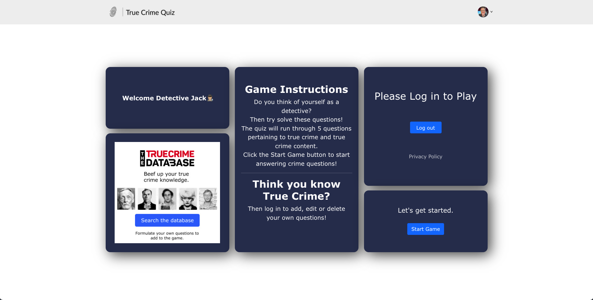
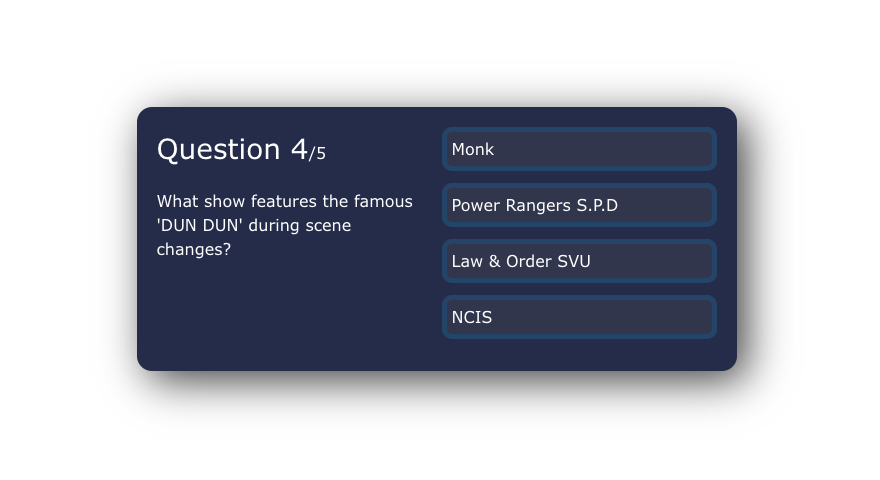

# True Crime Quiz

Mini quizzes on True Crime information.

## Table of Contents

1. [Description](#description)
2. [Technologies](#technologies)
3. [Setup](#setup)
3. [Getting Started](#getting-started)
4. [Team Members](#team-members)
5. [Screenshots](#screenshots)
6. [Links](#links)

## Description

This project is a website that provides mini quizzes on True Crime information. The website allows users to create an account that will allow them to create their own quizzes as well as keep track of their quiz scores.

## Technologies

This project is created with:

- Express version: 4.17.1
- Mongo JS version: 3.1.0
- Mongoose version: 6.0.13
- Nodemon version: 2.0.15
- Path version: 0.12.7
- Emotion React version: 11.6.0
- Emotion Styled version: 1.11.6.0
- MUI Icons-Material version: 5.2.0
- MUI Material version: 5.2.0
- MUI Styled-Engine version: 5.1.0
- Bootstrap version: 5.1.3
- Framer Motion version: 4.1.17
- React Bootstrap version: 2.0.2
- React Router DOM version: 6.0.2
- Styled Components version: 5.3.3

## Setup

To run this project, install it locally using npm

- $ npm install express
- $ npm install mongodb
- $ npm install mongoose
- $ npm install nodemon
- $ npm install @emotion/react
- $ npm install @emotion/Styled
- $ npm install @mui/icons-material
- $ npm install @mui/material
- $ npm install @mui/styled-Engine
- $ npm install bootstrap
- $ npm install framer-motion
- $ npm install react-bootstrap
- $ npm install react-router-dom
- $ npm install styled-components

<!-- GETTING STARTED -->
## Getting Started
These are instructions on setting up this project locally on your machine. To get a local copy up and running follow these simple example steps.


### Prerequisites
Make sure you have the latest installation of NPM (Node Package Manager) by following this step.
* Install/update NPM
   ```sh
   npm install npm@latest -g
   ```


### Installation
1. Clone the repo
   ```sh
   git clone https://github.com/bretpeters3n/true-crime-quiz.git
   ```
2. Install NPM packages
   ```sh
   npm install
   ```
3. Run project
   ```sh
   npm run start
   ```

<p align="right">(<a href="#top">back to top</a>)</p>

## Team Members

- Bret Petersen (https://github.com/bretpeters3n)
- Emily Daniel (https://github.com/emilyelizabethdaniel)
- Jack Theisen (https://github.com/Kay0ss)
- Lindsey Theis Betsinger (https://github.com/linbets)

## Screenshots




## Links

Heroku deployment:
https://true-crime-quiz.herokuapp.com/
